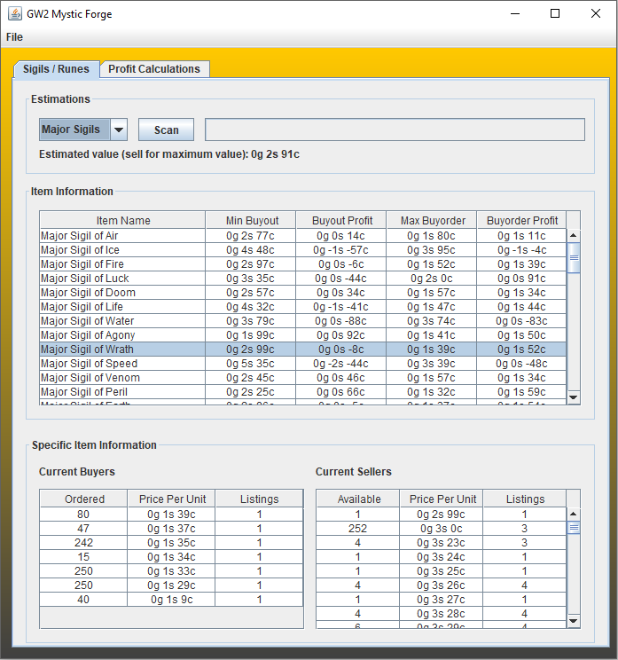
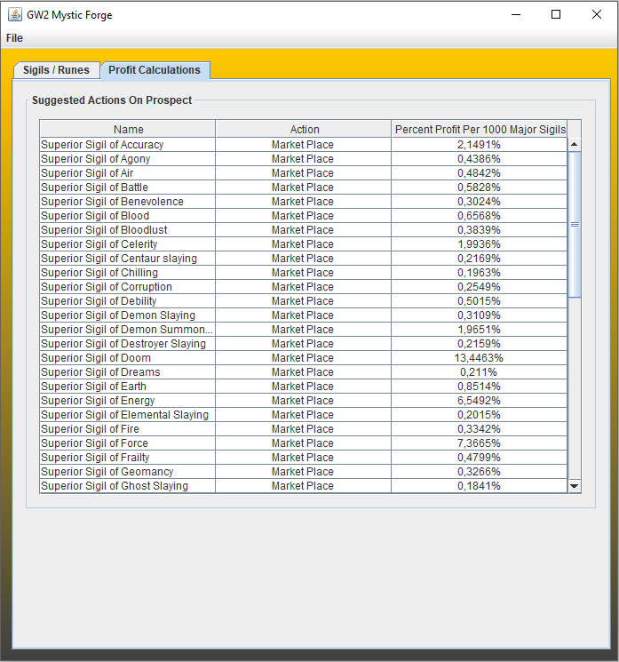

# GW2 MysticForge
In the game Guild Wars 2, there is a mystic forge that can convert a specific amount of runes or sigils into one different rune or sigil, but at random.
The result is usually a different rune or sigil of the same grade, but sometimes the result is a rune or sigil of a higher grade (thus worth more currency). 

This project fetches market data by sending requests to the GW2 API.
This data is then processed in order to determine if certain runes / sigils are worth buying from the marketplace for the purpose of
using this mystic forge to generate better runes or sigils and then selling them.

The probabilities of higher grades etc used in the program have been tested by myself (by performing the action thousands of times).

Usage of this program has made me an enourmous amount of money as well as many of my friends in the past. 
Feel free to take advantage of it.

Screenshots: 

  
  

